# DocuMind AI

A production-ready **Retrieval Augmented Generation (RAG)** chatbot that lets you upload PDF documents and ask natural-language questions — with precise page-level citations and conversation memory.

---

## Architecture

```mermaid
flowchart TD
    User["User (Browser)"]
    ST["Streamlit Frontend\n:8501"]
    API["FastAPI Backend\n:8000"]
    PDF["PDF Parser\n(PyPDF2 / pypdf)"]
    SPLITTER["Text Splitter\n(Recursive / sentence-aware)"]
    EMBED["Embedding Model\n(all-MiniLM-L6-v2)"]
    CHROMA["ChromaDB\n(local persistent)"]
    LLM["LLM\n(Claude / GPT-4o-mini)"]

    User -->|"upload PDFs"| ST
    ST -->|"POST /api/upload"| API
    API --> PDF --> SPLITTER --> EMBED --> CHROMA
    User -->|"ask question"| ST
    ST -->|"POST /api/query"| API
    API -->|"embed question"| EMBED
    EMBED -->|"similarity search"| CHROMA
    CHROMA -->|"top-k chunks"| API
    API -->|"prompt + context"| LLM
    LLM -->|"answer + citations"| API
    API -->|"QueryResponse"| ST
    ST -->|"display"| User
```



---

## Features

| Feature | Detail |
|---|---|
| Multi-PDF upload | Up to 10 MB per file, any number of files |
| Sentence-aware chunking | 1000-char chunks, 200-char overlap, never splits mid-sentence |
| ChromaDB vector store | Persistent local storage, one collection per session |
| Embeddings | `sentence-transformers/all-MiniLM-L6-v2` (runs offline) |
| LLM providers | Anthropic Claude **or** OpenAI GPT (auto-detected) |
| Citations | `[Source: file.pdf, Page X]` parsed from every answer |
| Confidence scoring | Weighted average of retrieval similarity + source count |
| Conversation memory | Last 10 turns included in LLM context |
| Query suggestions | 5 AI-generated questions after each upload |
| Export | Download full Q&A session as Markdown |
| Docker | Single `docker-compose up` for full stack |

---

## Quick Start

### 1 — Prerequisites

- Python 3.11+
- An API key for **Anthropic** (`sk-ant-…`) **or** **OpenAI** (`sk-…`)

### 2 — Clone & configure

```bash
git clone https://github.com/your-org/documind-ai.git
cd documind-ai
cp .env.example .env
# Edit .env and set your ANTHROPIC_API_KEY or OPENAI_API_KEY
```

### 3 — Backend

```bash
cd backend
python -m venv venv
# Windows:
venv\Scripts\activate
# macOS / Linux:
source venv/bin/activate

pip install -r requirements.txt
cd ..
uvicorn backend.main:app --reload --port 8000
```

Browse to **http://localhost:8000/docs** for the interactive Swagger UI.

### 4 — Frontend

In a second terminal (from the project root, venv active):

```bash
pip install -r frontend/requirements.txt
streamlit run frontend/streamlit_app.py
```

Browse to **http://localhost:8501**.

---

## Docker Deployment

```bash
cp .env.example .env      # fill in your API key
docker-compose up --build
```

- Frontend: http://localhost:8501
- Backend API: http://localhost:8000/docs

ChromaDB data persists in a named Docker volume (`documind_chroma`).

---

## API Reference

### `POST /api/upload`

Upload one or more PDF files to create (or add to) a collection.

**Request** — `multipart/form-data`

| Field | Type | Description |
|---|---|---|
| `files` | File[] | PDF files |
| `collection_id` | string? | Reuse existing collection |

**Response**

```json
{
  "collection_id": "3fa85f64-...",
  "uploaded_files": ["report.pdf", "paper.pdf"],
  "total_chunks": 142,
  "suggested_questions": ["What is the main conclusion?", "..."],
  "status": "success",
  "message": "Processed 2 document(s) into 142 chunks."
}
```

---

### `POST /api/query`

Ask a question against a collection.

**Request body**

```json
{
  "collection_id": "3fa85f64-...",
  "question": "What methodology was used?",
  "conversation_history": [
    {"role": "user", "content": "What is this paper about?"},
    {"role": "assistant", "content": "This paper discusses ..."}
  ],
  "top_k": 5,
  "temperature": 0.3
}
```

**Response**

```json
{
  "answer": "The authors used a mixed-methods approach [Source: paper.pdf, Page 4].",
  "sources": [
    {
      "file": "paper.pdf",
      "page": 4,
      "text_excerpt": "We employed a mixed-methods design combining...",
      "similarity_score": 0.87,
      "chunk_index": 12
    }
  ],
  "confidence": 78.5,
  "model_used": "claude-sonnet-4-6"
}
```

---

### `GET /api/collections/{collection_id}`

Get metadata about a collection.

### `DELETE /api/collections/{collection_id}`

Delete a collection and all its vectors.

### `POST /api/clear-history`

Clear server-side conversation state (client also clears its own state).

---

## Running Tests

```bash
# From project root, with venv active:
pytest
```

Tests cover:

- Text chunking (overlap, sentence preservation, empty input)
- PDF text cleaning (whitespace, non-breaking spaces)
- Citation regex extraction
- Confidence score calculation
- API endpoints (health, upload validation, 404 handling)

---

## Project Structure

```
documind-ai/
├── backend/
│   ├── main.py                  # FastAPI app + lifespan
│   ├── config.py                # All settings (env vars)
│   ├── models/
│   │   ├── document.py          # Upload / collection models
│   │   └── query.py             # Query / response models
│   ├── services/
│   │   ├── embedding_service.py # sentence-transformers wrapper
│   │   ├── vector_store.py      # ChromaDB CRUD
│   │   ├── document_processor.py# PDF → chunks → vectors
│   │   └── rag_engine.py        # Full RAG pipeline + LLM
│   ├── api/
│   │   └── routes.py            # FastAPI endpoints
│   ├── utils/
│   │   ├── pdf_parser.py        # Page extraction + cleaning
│   │   └── text_splitter.py     # Recursive sentence-aware splitter
│   └── requirements.txt
├── frontend/
│   ├── streamlit_app.py         # Full Streamlit UI
│   └── requirements.txt
├── tests/
│   └── test_document_processing.py
├── .env.example
├── .gitignore
├── Dockerfile
├── docker-compose.yml
├── pytest.ini
└── README.md
```

---

## Configuration Reference

| Variable | Default | Description |
|---|---|---|
| `ANTHROPIC_API_KEY` | — | Anthropic Claude API key |
| `OPENAI_API_KEY` | — | OpenAI API key |
| `LLM_MODEL` | auto | Model name (auto-selected by provider) |
| `LLM_TEMPERATURE` | 0.3 | Sampling temperature |
| `MAX_TOKENS` | 1000 | Max tokens in LLM response |
| `LLM_TIMEOUT` | 30 | LLM request timeout (seconds) |
| `CHROMA_PERSIST_DIR` | `./chroma_db` | ChromaDB storage path |
| `EMBEDDING_MODEL` | `all-MiniLM-L6-v2` | HuggingFace model name |
| `CHUNK_SIZE` | 1000 | Max characters per chunk |
| `CHUNK_OVERLAP` | 200 | Overlap between adjacent chunks |
| `TOP_K` | 5 | Retrieved chunks per query |
| `MAX_FILE_SIZE` | 10485760 | Max PDF size in bytes (10 MB) |
| `BACKEND_URL` | `http://localhost:8000` | Frontend → backend URL |

---

## Cloud Deployment

### Backend → Railway

```bash
railway login
railway init
railway up
# Set env vars in Railway dashboard
```

### Backend → Render

1. Create a new **Web Service**, point to this repo
2. **Build command:** `pip install -r backend/requirements.txt`
3. **Start command:** `uvicorn backend.main:app --host 0.0.0.0 --port $PORT`
4. Add env vars in the Render dashboard

### Frontend → Streamlit Cloud

1. Push repo to GitHub
2. Go to share.streamlit.io → New app
3. Set **Main file path:** `frontend/streamlit_app.py`
4. Add `BACKEND_URL` secret pointing to your Railway/Render URL

---

## Performance

| Metric | Typical value |
|---|---|
| Document ingestion | ~2–5 s per PDF page |
| Query response time | 1–3 s (embedding + retrieval + LLM) |
| Embedding model load | ~5 s first call, cached thereafter |
| Cost per query (Claude Haiku) | < $0.001 |

---

## Roadmap

- [ ] Cross-encoder re-ranking for improved retrieval precision
- [ ] Streaming LLM responses via Server-Sent Events
- [ ] React frontend with PDF viewer and inline highlighting
- [ ] JWT authentication & multi-tenancy
- [ ] PostgreSQL for persistent conversation history
- [ ] Batch export to PDF with branding
- [ ] Support for DOCX, HTML, and Markdown input

---

## License

MIT © 2024 DocuMind AI
